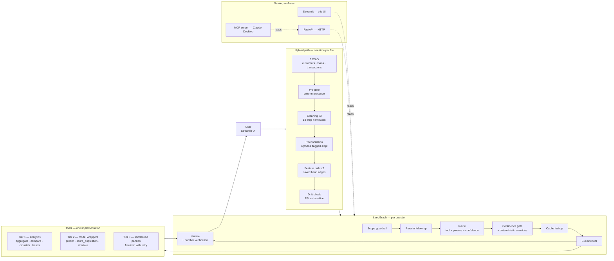
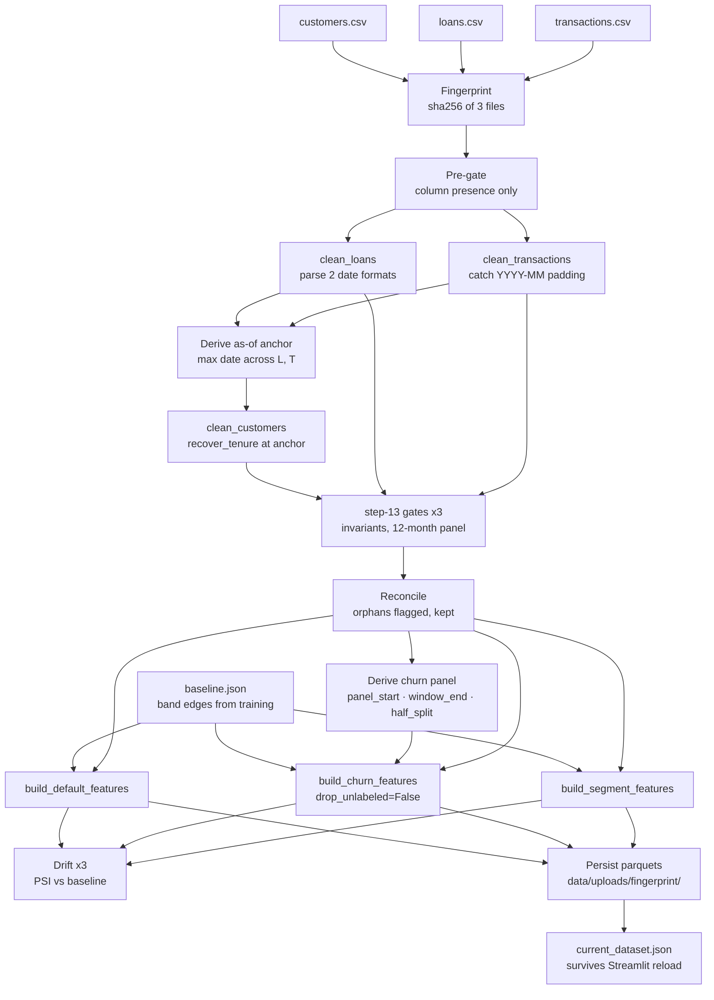
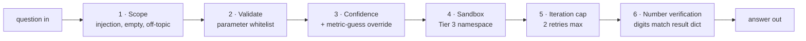
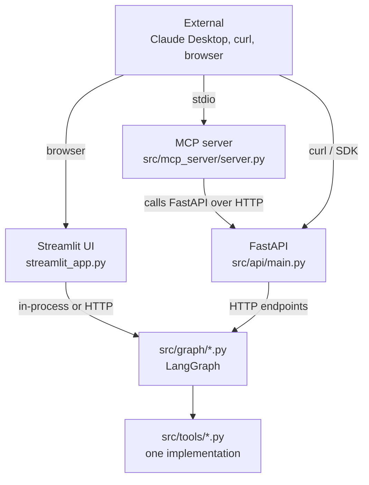

# FinSight — Conversational Product Analytics for Fintech

> A product manager at a digital wallet company uploads three CSVs — customers, loans, transactions — and asks questions in plain English. The system cleans the data, runs analytics, scores loans and customers with fitted models, and can escape to generated pandas for anything the fixed tools can't express. **Every answer is computed in Python; the LLM only routes and narrates.**

**Live demo:** [DEPLOYING TO STREAMLIT COMMUNITY CLOUD — LINK COMING] &nbsp;·&nbsp; 📄 **Business context and data dictionary:** [PROJECT_BRIEF.md](PROJECT_BRIEF.md)

---

## What you're looking at

Ask a real question about a real loan book and it answers with real numbers, chart included:


The chat above shows one full turn. The user asked *"what is the default rate by region?"*. The system routed to **Tier 1 · `aggregate_metric`**, ran the tool with `metric="defaulted"` and `group_by="region"`, and got back six rates plus the row counts behind them. The narrator turned that into a sentence, the chart renderer drew it below, and the small-group callouts (hatched bars for Balochistan and AJK-GB, both under 400 rows) came from the tool's own `small_groups` flag — not from the model deciding what to caveat. Confidence 0.97, 90 seconds end to end.

Underneath the chat is an Explore page for direct pandas — no model, no LLM, just charts against the loaded dataframe:


Both surfaces read the same dataset. Upload replaces it in place; a re-upload of the same file recognises itself by fingerprint rather than rebuilding.

---

## Why the project exists

Fintech companies sit on more data than their analysts can answer questions about. A product manager wants "the default rate by region for merchant loans in the last quarter" and it takes two days: someone writes SQL, someone else notarises the numbers, a deck gets built. By the time the answer arrives the question has moved on.

The failure mode of every naive fix — *just plug the CSVs into an LLM* — is well documented. The model hallucinates a number that looks right. The number gets pasted into a policy paper. Six months later a regulator asks how you decided, and nobody can trace it.

FinSight is the version that works within the constraint: **the LLM never touches the numbers.** It reads the question, picks a Python function to call, and phrases the function's output as a sentence. Every figure a user reads is one you could reproduce by running the same code in a notebook — and the system tells you which code.

That single decision is what shapes the rest of the architecture: parameterised tools with whitelisted inputs so the router can't invent a column that doesn't exist; a sandboxed escape hatch for the questions the fixed tools can't express; a six-layer guardrail stack with a counter for each; a Python check that verifies every number in the narrated answer came from the tool's own output.

The rest of this README explains how that constraint plays out in each subsystem, why the decisions were made this way, and what was rejected along the way.

---

## The one-screen picture



Read left to right. Upload the files once, then every question runs through the graph — routed, executed, narrated, and served back to whichever of the three interfaces was used.

---

## Quickstart

```bash
# clone
git clone https://github.com/ahmedsaeed56/finsight-analytics.git
cd finsight-analytics

# venv + dependencies
python -m venv .venv
.venv\Scripts\activate     # Windows
source .venv/bin/activate  # macOS / Linux
pip install -r requirements.txt

# environment
cp .env.example .env       # then fill in GOOGLE_API_KEY and APP_PASSWORD

# run
streamlit run streamlit_app.py
```

Open [localhost:8501](http://localhost:8501). Sign in, click **Load reference extract** in the sidebar, and start asking:

- *what is the default rate by region?*
- *do savings customers default less?*
- *show me my 20 riskiest loans*
- *how many loans are above 50,000 rupees?*
- *how does the default rate change by disbursement month?*
- *is credit score correlated with loan amount?*

The reference dataset auto-persists — restart Streamlit and it comes back loaded. To use your own data, drop three CSVs into the **Upload** tab and the pipeline runs end to end.

**Docker (identical, packaged):**

```bash
docker build -t finsight-analytics .
docker run -p 8501:8501 --env-file .env finsight-analytics
```

---

## Part 1 — the data science half

Before the AI layer could exist, the underlying dataset had to be trustworthy. Everything below happened first.

### The synthetic loan book

12,000 customers. 6,394 loans across four products (nano loans, device finance, emergency loans, merchant advances). 178,200 monthly transaction rows across a 15-month window. Six regions, uneven population weights that match Pakistan's real geography. Generation scripts in `scripts/` — the data is fake, but its shape isn't arbitrary.

Two constraints shaped the generator: it had to be realistic enough that findings would carry across (H1 below is the kind of relationship you'd hope to find in real data), and it had to contain enough intentional dirt that the cleaning pipeline was actually worth building. Both parts held up — cleaning caught real problems, and the models learned real signal.

### Cleaning — three tables, one 13-step framework

Every cleaning notebook follows the same 13 steps: schema, values, dates, missing, dupes, cross-column consistency, illegal values, edge cases, outliers, imputation, encoding, framing, assertions. Applied verbatim to customers, loans and transactions.

Three real bugs surfaced during cleaning that shaped the design of the pipeline layer that came later:

- **Trailing whitespace in `month` strings.** 133,619 of 178,200 transaction rows had `"2025-06   "` instead of `"2025-06"`. The `%Y-%m` parse failed silently on all of them until a NaT safety-net at step 13 caught it. Everything downstream had been reading a 44,581-row transactions table without realising. Fix: strip every string column at ingestion, and verify with an assert.
- **Two loan date formats mixed in one file.** ISO dashes and DD/MM slashes appeared in the same column. A two-pass `pd.to_datetime` with `combine_first` handled it — the alternative (guessing a format per row) would have parsed 30/03/2025 as 3 March.
- **Three cross-table twins in loans.** Three rows had negative `amount_pkr`, but the data to fix them (`avg_monthly_inflow_pkr` from customers) only became available at the merge. Cleaning parks such rows with an `amount_suspect` flag rather than guessing single-table. Reconciliation later recovers them via `abs(ratio × inflow)`.

The 13-step framework produced three cleaned parquets (`data/clean/`) and per-table case-study writeups (`docs/`) explaining every decision.

### EDA — nine hypotheses, seven confirmed

Formal EDA came next: split by customer ID (12,000 train, 3,000 test, stratified on churn), imputation refit on train only, then hypothesis-driven analysis on nine specific propositions.

**H1 — loan-to-inflow ratio predicts default.** Confirmed and became the headline finding: 6.6% default in the lowest quintile, 34.5% in the highest, threshold at ~1.2× monthly income. Survived every confounder grid tested against it — held inside every product, every region, every credit-score band. This is the finding that shaped the A/B test that came next.

**H2 & H3 — credit score and tenure drive default.** Both confirmed, both independent. Credit-score effect was 16.1 points across bands, tenure effect 16.4 points — and both held when crossed against each other. Notably, credit score also appeared to drive churn at 8.3 points, but that effect collapsed entirely inside tenure bands. Same pair of variables, different targets, different behaviour. This is the case study for why the tool suite includes `crosstab_rate`: the confounder grid is what turns a pairwise correlation into a real finding.

**H4 — Balochistan defaults more.** Confirmed at a 5.9-point gap, p=0.005. Small sample warning: n=304 loans, which is why the tool later defaulted to `SMALL_GROUP=400` — Balochistan needs the flag on every answer that mentions it.

**H5 — complaints predict churn.** Confirmed at p ≈ 2.9e-22, one of the strongest signals in the data. 5.7% churn with zero complaints, 12.8% with two or more.

**H8 — insurance uptake concentrated in savers with dependents.** Confirmed, 10% baseline → 35% in the target segment. Later became a segmentation feature.

**H9 — Eid transaction spikes.** Confirmed at +46% volume in April, +113% value.

Two hypotheses failed. Both filed as findings rather than as errors — the ability to say *we tested this and it doesn't hold* is what makes the analysis useful.

### Feature engineering

Three separate feature tables, one per model target:

- **Default** (per loan, 6,394 rows) — customer traits joined to loan attributes, `disbursed_date` retained as the only date column that survives to features.
- **Churn** (per customer, 11,760 rows with labels + 240 that arrived after the panel closed and are scoreable but not trainable) — transaction behaviour over months 1-6, label from months 7-12. `drop_unlabeled=False` because a live customer has no label; dropping on absence would discard every row you wanted to score.
- **Segments** (per customer, 12,000 rows) — no target, no leakage rule.

Eight band columns (`age_band`, `credit_score_band`, `tenure_band`, `inflow_band`, `ratio_band`, `complaints_band`, `failed_txns_band`, `dependents_band`) built via quartiles or explicit cutoffs. Two subtleties worth naming:

- **Band edges are saved artefacts, not per-file computations.** `models/baseline.json` stores the exact quartile boundaries from training. Every subsequent upload reads the file and passes those edges into `add_bands`. Without this, "Q1" would cover different credit scores in January than February, and a user comparing months would be comparing two definitions.
- **`ratio_band` is not a quartile.** Cut at 1.24 and 3.5 — the boundaries that came out of H1's A/B test. The bands carry the finding rather than approximating it.

### Three models, one guardrail

Notebook 06 (default), 07 (churn), 08 (segments). Production sklearn `Pipeline` with `ColumnTransformer` for every model.

- **Default.** Logistic regression at AUC 0.758 val / 0.765 test. XGBoost tuned to depth-1 trees at 0.773 — the depth-1 result is the headline: signal is near-linear, which is what H1 already told us. The extra tree depth buys nothing.
- **Churn.** Logistic regression at ROC-AUC 0.709 / 0.738. Average precision 0.172 vs baseline 0.077, a 2.2× lift.
- **Segments.** K-Means. Merchants isolate cleanly at 91% purity — the one crisp cluster in the data. Silhouette flat at 0.247 across K=2 through 10, which said what it said: customers sit on a continuum, not in clusters. Documented as a finding rather than tuned around.

The volume-guardrail analysis is the most important thing the modelling produced. A model with 0.765 AUC is good enough to price risk but not to decide access — at every threshold that produces reliable predictions, more than 15% of the book is rejected, which is the operational ceiling. So the models score for pricing, not for accept/decline. The A/B test came next to demonstrate this.

### The A/B test — 1.2× cap on loan-to-inflow ratio

Randomised assignment, 389 rows per arm (from an 80% power analysis at an 8-point detectable effect), cap tested at 1.2× monthly income.

**Result:** the cap works. 8.19 measured effect vs 8.0 injected, p ≈ 0. Statistically clean.

**But it breaches the volume guardrail at every powered cap.** 61.8% of the book by value falls above 1.2×, because high-ratio loans are 86% of book value while being only 40% of loan count. A deterministic sweep across every cap from 1.0× to 3.0× showed no flat cap satisfies both constraints simultaneously.

**Recommendation:** rejected as a flat policy, redirected to risk-based pricing tied to the trained default model. This is the A/B outcome the AI layer answers questions about — a real decision with a real trail.

---

## Part 2 — the AI engineering half

Everything above produced three parquets, three trained models, a baseline JSON, and about 400 pages of documented findings. The question the second half exists to answer: how does a product manager, without SQL, without pandas, without a data-team ticket, get to those findings tomorrow morning when the question they need is slightly different?

### The governing constraint

**The LLM routes and narrates. It never computes.**

Every number in every answer comes out of Python — a pandas expression, a sklearn `.predict_proba()`, a `scipy.stats.chi2_contingency`. The LLM's job is to pick which of those to run, with what parameters, and to phrase the result in a sentence. Nothing else.

That constraint is what makes the system auditable. When a regulator asks *why did you say 14.1%?*, the answer is *because `aggregate_metric("defaulted")` ran on this dataframe and returned 903/6394*. Not *because the model felt confident about it*.

Every subsystem below is either enforcing that constraint or making it useful.

### Tools — one implementation, three tiers

Every tool is a plain Python function in `src/tools/`. FastAPI, MCP, and the LangGraph executor all import the same functions. If FastAPI and MCP each implemented the tools, they'd drift within a week; the shared implementation is what keeps the three surfaces honest.

**Tier 1 — parameterised analytics.** Four tools, whitelisted metrics and group-by columns, `validate()` gate that rejects any parameter not on the allowlist:

| Tool | Answers | Example question |
|---|---|---|
| `aggregate_metric` | overall or by-group figure | *what is the default rate by region?* |
| `compare_groups` | is a difference real? (chi-square) | *do savings customers default more?* |
| `crosstab_rate` | confounder grid | *is the Balochistan gap just about product mix?* |
| `band_distribution` | how the book splits across levels | *how many loans in each ratio band?* |

Tier 1 is the majority of real questions. It's cheap, deterministic, and every answer has a table shape the chart renderer knows how to draw.

**Tier 2 — model wrappers.** Six tools that call the fitted sklearn Pipelines:

| Tool | Answers |
|---|---|
| `predict_default(loan_id)` / `predict_churn(customer_id)` | one score with top drivers |
| `score_population(model, limit)` | *who is most likely to…* — ranked list |
| `simulate_loan(...)` | score a loan that doesn't exist yet |
| `get_segment_profile(customer_id)` | K-Means cluster + centroid distances |
| `get_feature_importance(model, n)` | what the model relies on |

Every prediction carries a `top_drivers` breakdown (coefficient × scaled value — SHAP considered and rejected because for logistic regression it's the same information with none of the dependency weight).

**Tier 3 — sandboxed generated pandas.** One tool, `answer_freeform(question, table)`. The LLM writes a single pandas expression against `df`; `run_sandboxed()` evals it against a whitelisted namespace (`df`, `pd`, plus a small allowlist of builtins: `len`, `sum`, `min`, `max`, `abs`, `round`, `any`, `all`, `sorted`, `int`, `float`, `str`, `bool`). `open`, `__import__`, `exec` and `compile` are absent. Failure returns a shaped error and the loop retries once. Cap is two.

Tier 3 exists because the parameterised tools can't express everything real users ask:

- **A number in the question** — *loans above 50,000*, *customers with more than 2 complaints*. `filters` matches values exactly, no "greater than".
- **A column that exists as a metric but not a group-by** — you can average `credit_score` but you can't split by it (that's what `credit_score_band` is for; Tier 3 handles the case where the user names a specific number the bands don't sit on).
- **A statistic no signature has a slot for** — percentiles, correlations, compound conditions.
- **Disbursement timing** — `disbursed_date` exists but no group-by column holds a month.

**Escalation is a graph-level rule, not a prompt hope.** After the second retry at any tier, the router is forced to escalate to `answer_freeform`. Without this, a whole tier goes unused because the router keeps re-picking the same failing Tier 1 tool.

### The pipeline — three CSVs to three feature tables



**Why this order:** `recover_tenure` needs the as-of anchor. The anchor is derived from `disbursed_date` and `month` — both parsed dates. Loans and transactions clean first, the anchor comes out of them, customers cleans against it. Customers can't go first because raw date strings sort alphabetically and `max()` returns nonsense.

**Handling new inputs:**

- A new categorical value (a seventh region) → cleaning flags it, analytics works, scoring refuses that row. A config edit accepts it. Model refit is a separate pipeline.
- A missing required column → pre-gate rejects the file with a message naming what's missing. Never a stack trace twelve steps deep.
- Extra columns → reported as a warning, not silently dropped.
- **Same file uploaded twice** → recognised by fingerprint, pointer updated, no rebuild.

### The graph — ten nodes per question


**Design choices worth naming:**

- **The rewriter runs before the router.** Follow-ups like *and by region?* are resolved into standalone questions so the router only ever sees complete input. Under-resolve rather than over-resolve is the rule — a spurious filter carried across is worse than one clarifying turn.
- **Retry is a visible edge, not a hidden loop inside execute.** A trace shows one router pass or two; you never wonder whether a silent retry happened.
- **Cache sits after the router, before execute.** Keyed on `(fingerprint, tier, tool, sorted-params)`. Cache hits still narrate — the cache saves the expensive part (Tier 3 pandas generation, ~10-15 seconds), not the cheap part (writing a sentence).
- **Tool stored as string in state, not as enum.** Msgpack serialises strings cleanly; enum objects issue a warning and re-hydrate as strings anyway. `route_node` normalises this in one line.
- **Checkpointer is SQLite (`graph_checkpoints.db`).** Every turn is resumable. In practice this made two bugs findable: leaked per-turn state from a previous conversation, and follow-ups short-circuiting on restored `answer` fields.

### The guardrail stack — six control points



Each is a pure function with a counter in SQLite. The counters are visible on the **Control room** page — a count stuck at zero is how you find a guardrail that never worked.

1. **Scope** — prompt injection (*ignore previous instructions…*), empty messages, questions clearly outside the loan-book domain. Blocked in ~0.15s; a real answered turn takes 6–47 seconds. The gap is a diagnostic — if real turns start blocking in 0.15s, something has broken.
2. **Validate** — the router proposed a `metric` or `group_by` the data doesn't have. Returns a factual error naming the closest valid options. `ToolError` is caught by the graph, which reroutes.
3. **Confidence** — router self-reports 0–1. `>= 0.90` proceeds, `0.70–0.89` proceeds and logs, `< 0.70` clarifies. Plus a **deterministic override**: `aggregate_metric` with `group_by` set and a metric the user didn't name (checked against a synonym table) is forced to clarify regardless of self-reported confidence. This closes the *what's the rate by region?* → silently picks defaults bug that no prompt tuning could fix.
4. **Sandbox** — Tier 3 code runs in the whitelisted namespace above. `len` was originally omitted and every count-above-threshold Tier 3 question died — added back with the reasoning documented.
5. **Iteration cap** — Tier 3 retries once on error. Above two attempts, the loop stops and the failure is honest. This is also what triggers force-escalate: two failures at Tier 1/2 → the third attempt is Tier 3.
6. **Number verification** — every number (two-digit minimum) in the narrated answer must appear in the result dict, after normalisation (percent ↔ decimal, comma-stripped, 1% tolerance). Failures don't block the answer — they flag it with a banner. The check walks dict keys as well as values, because pandas Series serialise their index as keys. Prose scaffolding (10, 100, 1000 — *top 10*, *in every 100*) is skipped to avoid false alarms.

**Why the six are separate and not one big check:** each has a distinct failure mode with a distinct counter, and each answers a different *is the system working* question. Merging them hides the diagnostic.

### Memory & cache

**Conversation memory** — SQLite table of (thread_id, question, answer, tool, params, timestamp). Powers the "recent chats" sidebar and gives the rewriter context. Truncated after a configurable window; older turns summarised into a running text field per thread.

**Cache** — SQLite table keyed on `(fingerprint, tier, tool, sorted-params-json)`. Any question with the same inputs against the same dataset returns the same cached result. WAL journal mode is set at connection time — without it, concurrent Streamlit reruns saw stale reads and identical questions kept missing the cache. The `cache_hit` flag prevents the same row being re-written on a hit.

**Dataset pointer** — `data/current_dataset.json` names the parquets the tools are currently reading, plus label and fingerprint. Auto-hydrated on `src/tools/dataset.py` import. This is what makes the loaded dataset survive Streamlit's occasional `sys.modules` reset — module globals wouldn't, but a file on disk does.

### Serving — three doors, one implementation



**Streamlit** — the primary interface. Runs the graph in-process by default; a sidebar toggle switches to API mode (HTTP calls to FastAPI). Same graph, either way.

**FastAPI** — one endpoint per tool plus `/ask` for the full graph, `/health`, `/dataset`, and `/counters`. Pydantic validation on request, structured logging, `_DATA` sits at module level in the same `src.tools.dataset` the graph uses.

**MCP** — `MCPServer` (v2 API). Four tools: `ask`, `get_dataset`, `list_tools`, `get_vocabulary`. Wraps the FastAPI layer over HTTP rather than importing the graph. Claude Desktop can hit it and query the loan book without touching the Streamlit UI — proves the tools are an interface, not notebook code.

### The eval set

30 questions, each with an expected tool. Run it, measure accuracy. Includes the hard cases deliberately:

- *how did churn change over the year* → **must refuse** (churn is a single yearly verdict, no timing)
- *score a hypothetical applicant* → **must refuse** (no such row to score)
- *why do savers default less* → `compare_groups`, and narration must frame it as association not cause
- *what does the high band mean* → policy from `schema.md`, no tool call

30/30 on the current build. Doubles as a coverage test: anything mapping to no tool is a missing operation shape. Results in `src/eval/eval_results.json`.

---

## Decisions log — what was rejected and why

Portfolios that only list what was built read like brochures. What was considered and rejected, with the reasoning, is what makes the design legible.

**Rejected: RAG.** No corpus to retrieve from. The tools ARE the retrieval.

**Rejected: a pure agent loop.** The analytical surface is enumerable — eleven tools cover the questions a product manager asks. An agent picking tools at runtime adds non-determinism to routing decisions that regulators will want to audit. Kept: an agent-shaped surface (chat, tool use, memory) with a workflow-shaped implementation.

**Rejected: multi-agent.** No agent-shaped decomposition of the problem. A "validator agent" and an "analyst agent" and a "narrator agent" would each be one function of the current graph, dressed up.

**Rejected: fine-tuning.** No supervised dataset. Zero-shot with strong prompts plus a validator that rejects malformed outputs beats fine-tuned gibberish. Gemini Flash Lite is cheap enough that a larger prompt costs nothing meaningful.

**Rejected: SHAP for feature attribution.** For logistic regression, `coefficient × scaled_value` is the same information as SHAP with none of the dependency weight.

**Rejected: an LLM judge for number verification.** Two model calls per turn instead of one, and the same failure mode — an LLM asked to check LLM output. Regex plus normalisation catches transcription errors deterministically.

**Rejected: auto-learning categorical values.** If `VALID_REGIONS` is rebuilt from whatever arrives, the membership test can never fail — the file defines what's valid — and "Punajb" becomes a permanent seventh region. Config is a record of what's CORRECT, not of what's in the data.

**Rejected: LLM for cleaning decisions.** Non-deterministic. *The model felt it was wrong that day* is not an answer to a regulator asking why a row was dropped. Where an LLM does fit: proposing a mapping for a human to approve, never applying it.

**Rejected: two datasets loaded at once.** Would put dataset-selection into the router — *does this question refer to last month's file or this one?*. Real feature, v2. v1 loads one at a time; comparing across uploads returns `out_of_scope` with the reason in plain language.

**Rejected: recomputing band edges per upload.** Q1 would cover different credit scores in January than February; a user comparing months would be comparing two definitions.

**Rejected: dropping rows that fail reconciliation.** Orphan loans are real loans. Analytics answers correctly on them. What they can't have is a trustworthy model score — the fix is refusing the prediction, not deleting the row. Same discipline as withholding `p_value` when a cell is too thin.

**Rejected for v1: giving Tier 3 access to the cleaned tables.** Would make every original column reachable. Router complexity roughly doubles — six tables instead of three, plus a *which table?* decision the router gets wrong on borderline questions. The specific columns that come up (`interest_rate_pct`, others) either have workarounds or are answerable from feature tables. Deferred to v2 with the limitation documented rather than hidden.

**Rejected: docker-compose with three containers.** One container running Streamlit in-process is enough for a portfolio deployment. Splitting Streamlit, uvicorn and MCP across three containers adds operational surface with no user-facing benefit at this scale.

---

## Limitations — named, not hidden

**Model provenance.** v1 scores today's loans with a model fitted on year-old loans. Normal for credit models, and precisely why drift monitoring exists. Input drift (PSI on today's inputs vs training inputs) is detectable the day the file lands, no labels needed. Performance decay needs labels and waits out the label horizon.

**Tenure floor.** The reference extract contains no customer under ~9 months tenure. Both models extrapolate for genuinely new customers. A number still comes back and its direction is almost certainly right; the magnitude is unverified. Real deployment data contains new customers, so this disappears.

**Score-then-train.** New rows have no label — a loan disbursed today has no `defaulted` value for months. So the system scores on arrival and trains only on matured rows. Two pipelines at different speeds is the honest design, not a shortcut.

**No PAR, no ageing.** The outcome is a flag with no days-past-due. PAR 30, PAR 90, roll rates, provisioning — none of it is derivable. Refusals explain what IS available instead.

**Cross-grain refusal.** A metric on one table grouped by a column on another is refused rather than auto-joined. `aggregate_metric("churned_12m", group_by="ratio_band")` passes the whitelist but the churn table is per-customer (11,760) and `ratio_band` is per-loan (6,394); a silent join would drop 5,366 non-borrowers and answer a different question.

**One dataset at a time.** Loading a new dataset replaces the old. No comparison across uploads.

**Multi-user.** One dataset is shared across all users. In a real deployment, user A uploading would silently replace user B's file. Fine for a portfolio demo; wrong for production. v2 needs per-user scoping, which needs auth, which needs a user model.

**No fine-grained access control.** Anyone with the app password sees everything. Real deployment would need role-based access.

---

## Tech stack

**Data & modelling** — Python 3.11, pandas, numpy, pyarrow, scikit-learn (logistic regression, K-Means, ColumnTransformer pipelines), XGBoost (depth-1 trees for the near-linear default signal), scipy and statsmodels for hypothesis tests and power analysis.

**LLM & orchestration** — Google Gemini Flash Lite for routing and expression generation, Gemini Flash for narration, LangGraph for the per-question state machine with SqliteSaver checkpointing, LangChain for the Gemini structured-output adapter, LangSmith for traces and per-turn cost (wired as a callback so the app runs without it).

**Serving** — Streamlit (four workspaces), FastAPI and Uvicorn (one endpoint per tool plus `/ask`), MCP Python SDK for the Claude Desktop integration.

**Persistence** — SQLite in WAL mode for cache, counters, conversation store and graph checkpoints. Parquet for feature tables, cleaned tables and upload snapshots. JSON for the dataset pointer, the band-edge baseline and eval results.

**Dev** — Jupyter for EDA, hypothesis testing and model training. No pytest; a 30-question eval set in `src/eval/` serves the same purpose for the routing layer. Docker for packaging.

---

## Repository layout

```
finsight-analytics/
├── streamlit_app.py                Primary UI
├── requirements.txt
├── Dockerfile · .dockerignore
├── PROJECT_BRIEF.md                Data dictionary + business framing
│
├── src/
│   ├── api/                        FastAPI: client, main, models
│   ├── cleaning/                   customers.py, loans.py, transactions.py
│   ├── eval/                       30-question routing eval set + runner
│   ├── features/                   default.py, churn.py, segments.py, bands.py
│   ├── graph/                      LangGraph: build, router, execute, narrate
│   ├── guardrails/                 scope, confidence, numbers, counters
│   ├── mcp_server/                 MCP server (Claude Desktop)
│   ├── memory/                     cache, conversation, rewrite, summarise
│   ├── models/                     train_*, scoring, importance, baseline
│   ├── pipeline/                   orchestrator, gate, reconcile, drift
│   ├── tools/                      analytics, inference, freeform, dataset, errors
│   ├── config.py                   paths and constants
│   ├── llm.py                      Gemini configuration
│   └── store.py                    SQLite connection (WAL)
│
├── prompts/                        router · tools · narrate · rewrite
│                                   freeform · schema · summarise
├── notebooks/                      EDA, A/B, features, models, cleaning
├── docs/                           Per-table cleaning case studies
├── models/                         Trained pickles + band-edge baseline
├── data/
│   ├── raw/                        Reference CSVs
│   ├── clean/                      Cleaned parquets
│   ├── features/                   Feature tables (train + test)
│   └── splits/                     Train/test id splits
└── assets/                         Screenshots + UI assets
```

---

## About the author

Built by [Ahmed Saeed](https://github.com/ahmedsaeed56) — AI/ML engineer focused on production RAG systems, LangGraph orchestration, and applied ML. This project is one of two portfolio deliverables; the other is [LegalSpy](https://github.com/ahmedsaeed56?tab=repositories), a Pakistani legal research RAG system where the retrieval-vs-tools decision went the opposite way.

**Datasets:** synthetic, generated for portfolio purposes. Structured to plausibly resemble a Pakistani mobile-wallet lending book but containing no real customer data. Generation scripts are in `scripts/`.

**Reading the code from the top:** `streamlit_app.py` → `src/api/client.py` → `src/graph/build.py` → then the individual node files and the tool implementations. The `prompts/` folder is worth reading alongside the router and narrator; that's where most of the routing behaviour actually lives.

---

## License

MIT — see [LICENSE](LICENSE).
