# FinSight — Conversational Product Analytics for Fintech

> A product manager at a digital-wallet lender uploads three CSVs — customers, loans, transactions — and asks questions in plain English. The system cleans the data, runs the analytics, scores loans and customers with fitted models, and can escape to sandboxed pandas for anything the fixed tools can't express. **Every number a user sees is computed in Python. The LLM only routes and narrates.**

**Live demo:** https://finsight-analytics-researcher.streamlit.app &nbsp;·&nbsp; **Business context & data dictionary:** [PROJECT_BRIEF.md](PROJECT_BRIEF.md) &nbsp;·&nbsp; **Sister project:** [LegalSpy](https://github.com/ahmedsaeed56/LegalSpy) — same engineer, opposite architecture (RAG instead of tools)

---

> ### 🧭 Where this is heading (v2, in one breath)
> v1 answers questions and — because every answer is a traceable tool call — quietly builds an **audit trail of decisions**. v2 turns that trail into an asset: a RAG layer reads the company's **written lending policy** alongside FinSight's own **decision history**, checks each new decision for policy compliance *before* it ships, and surfaces the handful of **new pricing rules the history says would lift revenue** — each one routed to a human to approve or reject. The full story is at the end: [Where this goes next →](#where-this-goes-next--v2).

---

## What you're looking at

Ask a real question about a real loan book and it answers with real numbers, chart included:

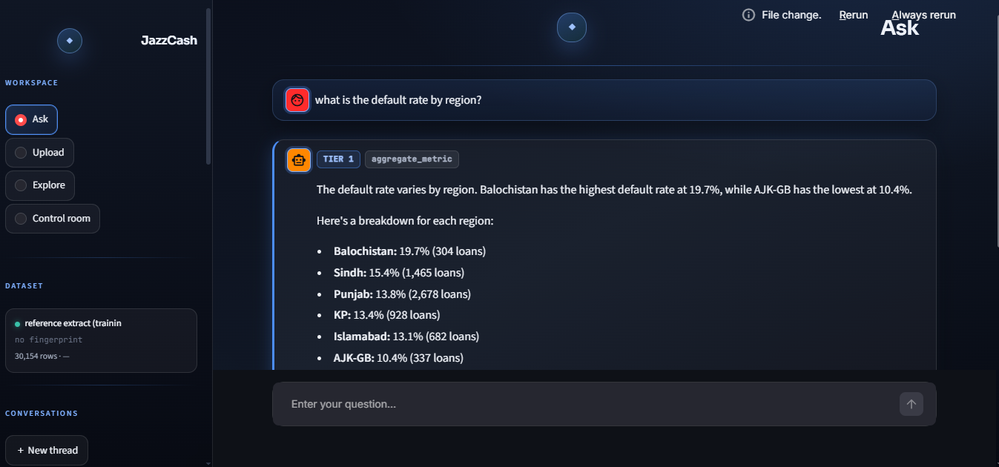

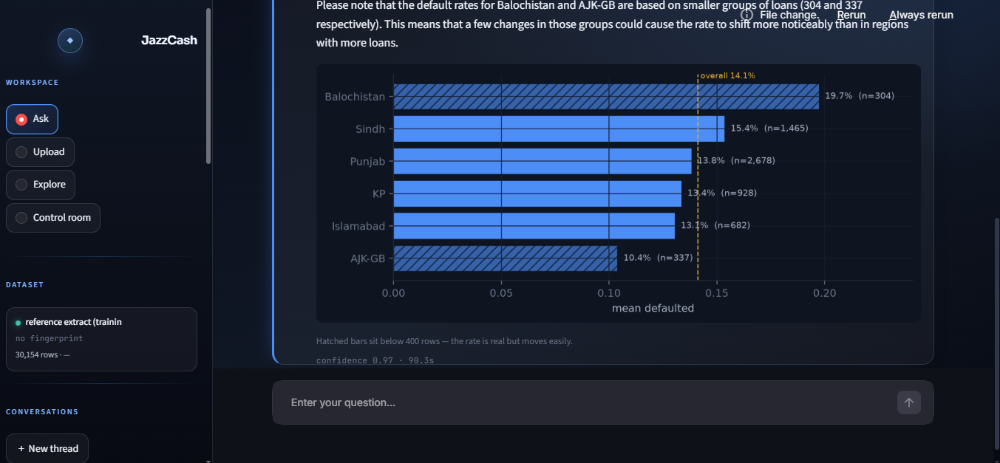

That's one full turn. The user asked *"what is the default rate by region?"* The system routed to **Tier 1 · `aggregate_metric`**, ran it with `metric="defaulted"`, `group_by="region"`, and got back six rates plus the row counts behind them. The narrator turned that into a sentence, the chart renderer drew it, and the hatched-bar callouts for Balochistan and AJK-GB (both under 400 rows) came from the *tool's own* `small_groups` flag — not from the model deciding what to caveat. Confidence 0.97, ninety seconds end to end.

Underneath the chat is an Explore page for direct pandas — no model, no LLM, just charts against the loaded dataframe:

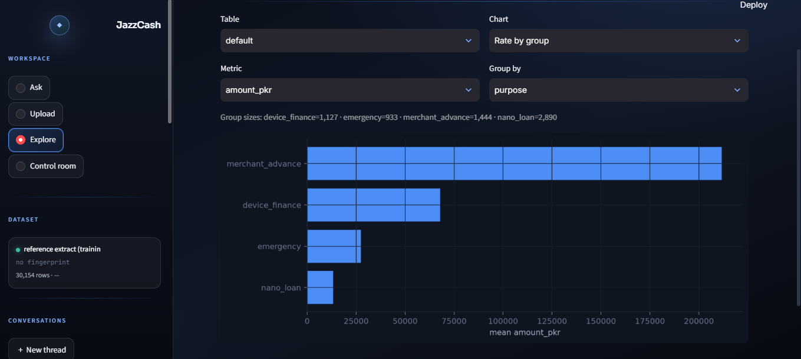

Both surfaces read the same dataset. Upload replaces it in place; re-uploading the same file recognises itself by fingerprint rather than rebuilding.

---

## Why the project exists

Fintech companies sit on more data than their analysts can answer questions about. A product manager wants *"the default rate by region for merchant loans last quarter"* and it takes two days: someone writes SQL, someone else notarises the numbers, a deck gets built. By the time the answer arrives the question has moved on.

The obvious fix — *just plug the CSVs into an LLM* — fails in a way that's well documented and, in lending, dangerous. The model hallucinates a number that looks right. The number lands in a policy paper. Six months later a regulator asks how the decision was made and nobody can trace it.

**FinSight is the version that works inside the constraint: the LLM never touches the numbers.** It reads the question, picks a Python function to call, and phrases that function's output as a sentence. Every figure a user reads is one you could reproduce by running the same code in a notebook — and the system tells you which code.

That single decision shapes everything downstream: parameterised tools with whitelisted inputs so the router can't invent a column; a sandboxed escape hatch for what the fixed tools can't express; a six-point guardrail stack with a live counter on each; and a Python check that verifies every number in the narrated answer came from the tool's own output. The rest of this README is the story of how that constraint plays out — **what problem each part solves, why it was built the way it was, what happened when it ran, and what got decided next.**

### The governing constraint

**The LLM routes and narrates. It never computes.**

Every number comes out of Python — a pandas expression, a sklearn `.predict_proba()`, a `scipy.stats.chi2_contingency`. The model's job is to pick which of those to run, with what parameters, and to phrase the result. When a regulator asks *why did you say 14.1%?*, the answer is *because `aggregate_metric("defaulted")` ran on this dataframe and returned 903/6,394* — not *because the model felt confident*.

---

## The one-screen picture


Upload the files once, then every question runs through the graph — routed, executed, narrated, and served back to whichever of the three interfaces asked.

---

## Quickstart

```bash
git clone https://github.com/ahmedsaeed56/finsight-analytics.git
cd finsight-analytics

python -m venv .venv
.venv\Scripts\activate       # Windows
source .venv/bin/activate    # macOS / Linux
pip install -r requirements.txt

cp .env.example .env         # fill in GOOGLE_API_KEY and APP_PASSWORD
streamlit run streamlit_app.py
```

Open [localhost:8501](http://localhost:8501), sign in, click **Load reference extract** in the sidebar, and ask:

- *what is the default rate by region?*
- *do savings customers default less?*
- *show me my 20 riskiest loans*
- *how many loans are above 50,000 rupees?*
- *how does the default rate change by disbursement month?*

The reference dataset auto-persists — restart Streamlit and it comes back loaded. To use your own data, drop three CSVs into the **Upload** tab and the whole pipeline runs end to end.

**Docker (identical, packaged):**

```bash
docker build -t finsight-analytics .
docker run -p 8501:8501 --env-file .env finsight-analytics
```

---

# Part 1 — the data-science half

Before the AI layer could exist, the dataset underneath it had to be trustworthy. This half is that work, told the way it happened: each step is a problem, a decision, a result, and the choice it forced next. One thread runs through all of it — **how much a customer borrows relative to what flows into their wallet is the thing that predicts default** — and everything from cleaning to the A/B test is in service of finding that thread and proving it holds.

## The synthetic loan book

**The problem.** Real lending data can't go in a public portfolio. But fake data with no structure teaches nothing — a cleaning pipeline that never meets a real bug, models that never find real signal.

**The decision.** Generate a three-table book with *deliberately injected* ground truths and *deliberately injected* dirt: 12,000 customers, 6,394 loans across four products (nano loans, device finance, emergency loans, merchant advances), 178,200 monthly transaction rows over a 15-month window, six regions weighted to resemble Pakistan's real geography. The generator plants relationships to rediscover (default rises with the loan-to-inflow ratio, falls with tenure; Balochistan defaults more; Eid transaction spikes) and mess to clean (sentinels, mixed date formats, whitespace, sign flips, duplicates).

**What happened.** Both halves held up — cleaning caught genuine problems, and the models learned genuine signal rather than memorising a generator rule. Generation scripts live in `scripts/`; the data is fake but its shape isn't arbitrary.

## Cleaning — three tables, one framework, three real bugs

**The problem.** Three tables at three grains (one row per customer, per loan, per customer-month), each dirty in its own way, all needing to reconcile at the end.

**The decision.** One reusable 13-step framework applied verbatim to all three: schema → values → dates → completeness → standardisation → membership → illegal values → outliers → dedup → missing → derived → formatting → a validation gate that saves nothing until every invariant asserts true. The discipline that mattered most: **never silently fix — park suspect rows behind a flag and resolve them where the evidence actually exists.**

**What happened — three bugs that shaped the pipeline layer built later:**

- **Whitespace in `month` strings.** 133,619 of 178,200 transaction rows held `"2025-06   "` instead of `"2025-06"`. The `%Y-%m` parse failed *silently* on all of them until a NaT safety-net at step 13 caught it — everything downstream had been reading a 44,581-row table without knowing. **Decision it forced:** strip every string column at ingestion, and back every fix with an assertion, because the step-13 gate had run green on a broken file once.
- **Two loan date formats in one column.** ISO dashes and DD/MM slashes mixed together. A naive per-row guess would read `30/03/2025` as 3 March. A two-pass `pd.to_datetime` + `combine_first` handled both without guessing.
- **Three cross-table twins.** Three loans had negative `amount_pkr`, but the data to fix them (`avg_monthly_inflow_pkr`, in the customers table) only arrived at the merge. **Decision:** park them behind an `amount_suspect` flag rather than fix single-table; reconciliation later recovered them via `abs(ratio × inflow)` and *proved* they were pure sign flips before touching them.

**What we decided next.** Every proven fix graduates from notebook into the owning table's cleaning module, with a matching assertion in its gate — so the parquet on disk is always correct and reconciliation only holds what genuinely needs cross-table evidence at runtime.

## EDA — nine hypotheses written before looking, seven confirmed

**The problem.** It's easy to find a pattern in data if you go looking after you've seen it. That's not analysis, it's storytelling.

**The decision.** Split first (12,000 train / 3,000 test, by customer, stratified on churn), quarantine the test set, write the hypotheses *before* touching the data — nine directional propositions with the grain and the target named up front — then test only that pre-written list. Rates get gap tests; measurements get effect sizes; the choice is made by column type, not by which gives a nicer number.

### The headline: H1 — default rises with the loan-to-inflow ratio

This is the thread the whole project hangs on.

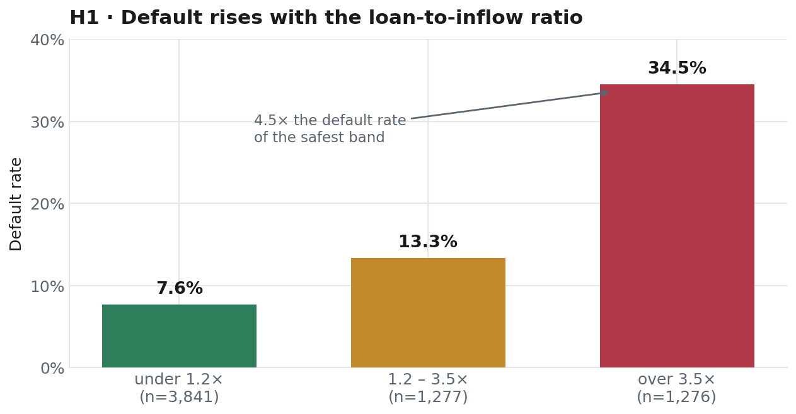

**What happened.** Default climbs from **7.6%** among borrowers whose loan is under 1.2× their monthly wallet inflow to **34.5%** above 3.5× — and by quintile the span is even wider, 6.6% in the lowest to 34.5% in the highest, a 5.2× spread. The critical test wasn't the rise itself but whether it *survived confounders*: it held inside every product, every region, and every credit-score band. A relationship that survives that many grids isn't a coincidence of the sample — it's structure.

**Why it matters.** This is a *behavioural* signal — what someone actually does with their wallet — beating the industry-standard credit score, which turned out real but weak (Cohen's d ≈ 0.22, heavy overlap between defaulters and repayers). A lender that already sees wallet inflows can price risk without a bureau score. That finding sets up the A/B test later, and it's the reason `ratio_band` is a first-class feature with hand-set cutoffs rather than a machine-picked quartile.

### The rest of the slate

- **H2 & H3 — credit score and tenure both drive default, independently.** 16.1 and 16.4 points across bands, and both held when crossed against each other. Notably, credit score *appeared* to drive churn too (8.3 points) — until it collapsed entirely inside tenure bands. Same variable, two targets, opposite verdicts. **This is exactly why the tool suite includes `crosstab_rate`:** the confounder grid is what turns a pairwise correlation into a defensible finding.
- **H4 — Balochistan defaults more.** Confirmed, 5.9-point gap, p = 0.005 — but on only n = 304 loans. **Decision it forced:** the tools later default to `SMALL_GROUP = 400`, so Balochistan carries a reliability flag on every answer that mentions it.
- **H5 — complaints predict churn.** One of the strongest signals in the data (p ≈ 2.9e-22): 5.7% churn with zero complaints, 12.8% with two or more.
- **H8 — insurance uptake concentrates in savers with dependents.** 10% baseline → 35% in that segment. Later became a clustering feature.
- **H9 — Eid transaction spikes.** Confirmed, and visible at a glance:

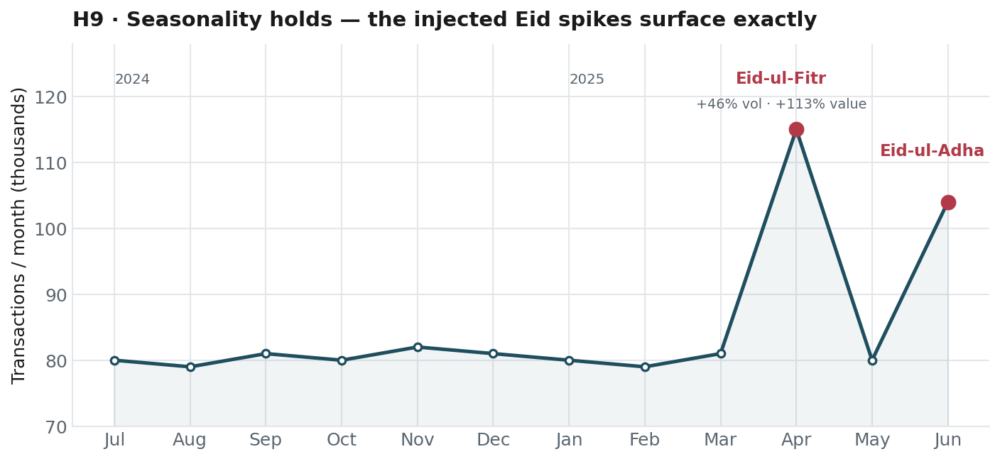

Flat at ~80,000 transactions a month, then **+46% volume in April** (Eid-ul-Fitr) and another spike in June (Eid-ul-Adha), with **+113% in value** — people transact more *and* bigger around Eid. No test needed; the injected seasonality surfaced exactly where it was planted.

**Two hypotheses failed** — and both were filed as findings, not errors. The ability to say *we tested this and it doesn't hold* is what separates analysis from decoration.

## Feature engineering — three tables, three grains, three leakage rules

**The problem.** The same three cleaned tables have to feed three models that predict different things at different grains — and the naive way to build features leaks the answer into the question.

**The decision — and the leak it closed.** The obvious move is to summarise each customer's transaction behaviour across all 12 months and feed that to every model. But for a loan disbursed in March that defaulted in June, the post-default collapse in wallet activity is *baked into the average* — the model would be shown the consequence of default and asked to predict default. So:

- **Default (per loan, 6,394 rows).** Every transaction feature is time-bounded to months strictly *before that loan's own disbursement date*. The move that made it clean: merge each loan's `disbursed_date` onto the transaction rows so a single column-vs-column filter (`month < disbursed_date`) applies across the whole frame at once. Averages are divided by `months_available` — a feature in its own right — so a 10-month loan doesn't look busier than a 2-month one for free.
- **Churn (per customer, 11,760 rows).** Behaviour from months 1–6, label from months 7–12 — a clean observation-then-outcome window. A direction feature (last-quarter minus first-quarter activity) captures *falling* engagement, which turned out to be the churn tell. `drop_unlabeled=False`, because a live customer has no label yet and dropping on absence would discard exactly the rows you want to score.
- **Segments (per customer, all 12 months).** No target, so no leakage rule — but the missingness flags and the answer-key column are dropped so clustering can't group people by which fields happened to be blank.

**What happened — one experiment worth naming, because it failed.** I tried to infer each customer's churn month from their trailing run of dead months and drop anyone who churned before the observation window closed, to remove all post-churn contamination. Built it, then crosstabbed the inference against the real label: at its best threshold it was right for only **64% of flagged customers** and caught **26% of known churners**. False positives — healthy customers wrongly deleted — were the expensive error, and no threshold made them rare. **Decision:** keep everyone, document the contamination, and write the honest line rather than ship a heuristic that quietly discards good customers. Knowing when *not* to use a clever idea is part of the work.

**What we decided next.** Band edges (the quartile boundaries behind `credit_score_band`, `tenure_band`, `inflow_band`) become **saved artefacts** from training, not per-file recomputations — otherwise "Q1" would mean different scores in January than February and a user comparing months would be comparing two definitions unknowingly. `ratio_band` is the exception: cut at 1.24 and 3.5 — the boundaries H1's analysis produced — so the band *carries* the finding rather than approximating it.

## Three models — and why the simplest one won

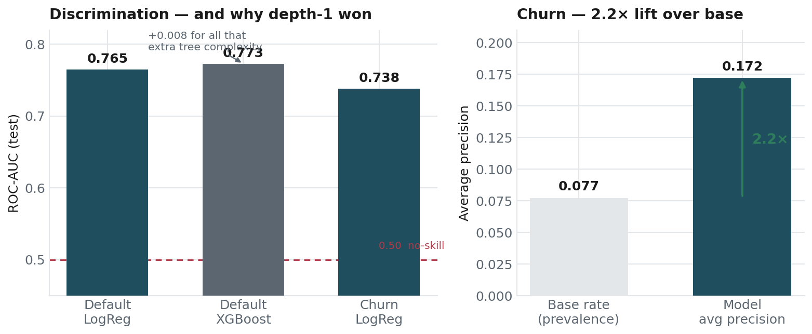

**The problem.** Predict which loans default and which customers churn, on an imbalanced book (14% default, 7.7% churn) where "predict nobody" scores 86% accuracy and means nothing.

**The decision.** Production sklearn `Pipeline` + `ColumnTransformer` for every model; evaluate on ROC-AUC and average precision, never raw accuracy; and — the choice that made the modelling honest — **let a tuned tree model tell us how much signal we were leaving on the table.**

**What happened.**
- **Default.** Logistic regression at **0.765 test AUC**. Then XGBoost, tuned — and the tuning collapsed the trees to **depth 1**, landing at 0.773. That's the headline the chart makes visible: an extra 0.008 AUC for all that tree complexity, because the signal is **near-linear**, exactly as H1 predicted. The simple, explainable model loses almost nothing — so it ships.
- **Churn.** Logistic regression at 0.738 test AUC, and an **average precision of 0.172 against a 0.077 base rate — a 2.2× lift**. Modest in absolute terms, real in relative terms, and honestly reported as such.
- **Segments.** K-Means. Merchants isolate cleanly at 91% purity — the one crisp cluster — but silhouette stays flat at 0.247 across K = 2 through 10. **Decision:** report the truth (customers sit on a continuum, not in tidy clusters) rather than tune until a number looked good.

**Why logistic regression, not the tree.** A 0.008 AUC gain isn't worth a black box in a regulated setting. Logistic coefficients are readable, defensible to a manager, and auditable to a regulator — and `top_drivers` (coefficient × scaled value) gives every prediction a plain-language *why* with no extra dependency. SHAP was considered and rejected: for a linear model it's the same information with more weight.

**What we decided next — the guardrail that reframed the whole system.** A 0.765-AUC model is good enough to *price* risk but not good enough to *decide access*: at every threshold that yields reliable predictions, more than 15% of the book gets rejected — past the operational ceiling a lender can absorb. So the models score for **risk-based pricing, not accept/decline.** That single finding is what the A/B test set out to test.

## The A/B test — a cap that works and breaks the business

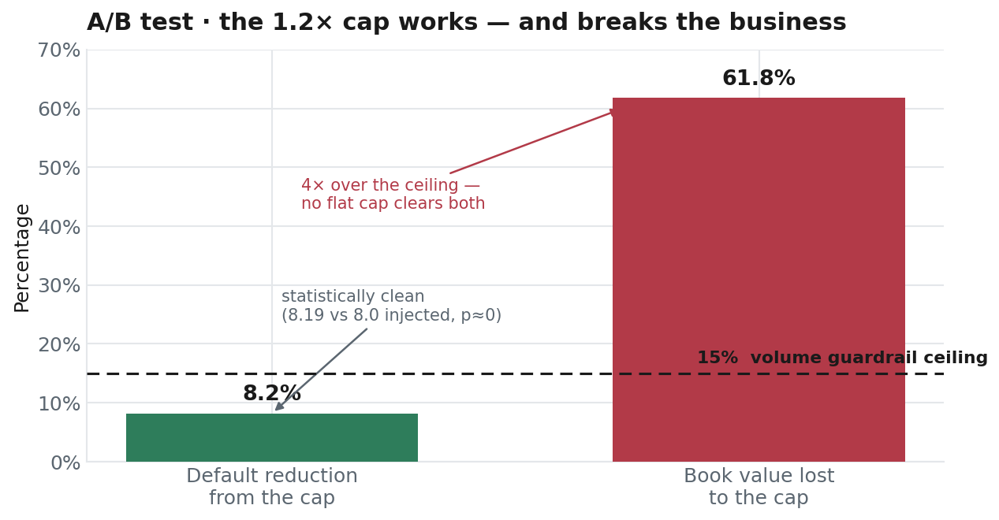

**The problem.** H1 says high-ratio loans default more. The tempting policy writes itself: cap lending at 1.2× wallet inflow. Does it actually work — and can the business survive it?

**The decision.** A proper randomised experiment: 389 rows per arm (from an 80%-power analysis at an 8-point detectable effect), the cap applied to the treatment arm, measured against a volume guardrail as a hard constraint rather than an afterthought.

**What happened.** The cap *works* — an **8.2-point reduction** in default (8.19 measured vs 8.0 injected, p ≈ 0), statistically clean. And it **destroys the book**: 61.8% of lending value falls above 1.2×, because high-ratio loans are 86% of book value while being only 40% of loan count. A deterministic sweep across every cap from 1.0× to 3.0× confirmed it — **no flat cap satisfies both constraints at once.** The chart is the whole story: the intervention clears the statistics bar and sails 4× past the volume ceiling.

**What we decided next.** Reject the flat cap; redirect to **risk-based pricing** tied to the trained default model — charge for risk instead of refusing it. This is the real decision, with a real trail, that the AI layer exists to answer questions about. And it's the seed of v2: a decision like this *should* be checked against written policy and its revenue impact surfaced automatically, which is exactly what the policy-RAG layer is for.

---

# Part 2 — the AI-engineering half

Everything above produced three parquets, three trained models, a baseline JSON, and a few hundred pages of documented findings. This half answers one question: **how does a product manager — no SQL, no pandas, no data-team ticket — get to those findings tomorrow morning, when the question they need is slightly different?**

The governing constraint from the top of this README is the answer's spine: *the LLM routes and narrates, it never computes.* Every subsystem below is either enforcing that or making it useful.

## Tools — one implementation, three tiers

Every tool is a plain Python function in `src/tools/`. FastAPI, MCP, and the LangGraph executor all import the *same* functions — if each surface implemented its own, they'd drift within a week.

**Tier 1 — parameterised analytics.** Whitelisted metrics and group-bys, a `validate()` gate that rejects any parameter not on the allowlist:

| Tool | Answers | Example |
|---|---|---|
| `aggregate_metric` | overall or by-group figure | *default rate by region?* |
| `compare_groups` | is a difference real? (chi-square) | *do savers default more?* |
| `crosstab_rate` | confounder grid | *is the Balochistan gap just product mix?* |
| `band_distribution` | how the book splits across levels | *how many loans in each ratio band?* |

Cheap, deterministic, and every answer has a table shape the chart renderer already knows how to draw. This is the majority of real questions.

**Tier 2 — model wrappers.** Six tools over the fitted Pipelines: `predict_default(loan_id)` / `predict_churn(customer_id)` (one score + `top_drivers`), `score_population(model, limit)` (*who's most likely to…*), `simulate_loan(...)` (score a loan that doesn't exist yet), `get_segment_profile(customer_id)`, `get_feature_importance(model, n)`.

**Tier 3 — sandboxed generated pandas.** One tool, `answer_freeform(question, table)`. The LLM writes a single pandas expression against `df`; `run_sandboxed()` evals it in a whitelisted namespace (`df`, `pd`, and a short allowlist of builtins — `len`, `sum`, `min`, `max`, `abs`, `round`, `any`, `all`, `sorted`, plus the casts). `open`, `__import__`, `exec`, `compile` are absent. It exists for what fixed tools can't express: **a number in the question** (*loans above 50,000*), **a column that's a metric but not a group-by** (*split by exact credit score*), **a statistic with no signature slot** (percentiles, correlations), and **disbursement timing**. Failure returns a shaped error and the loop retries once, capped at two.

**Escalation is a graph rule, not a prompt hope.** After the second retry at any tier, the router is *forced* to escalate to `answer_freeform` — otherwise a whole tier goes unused because the router keeps re-picking the same failing Tier 1 tool.

## The pipeline — three CSVs to three feature tables

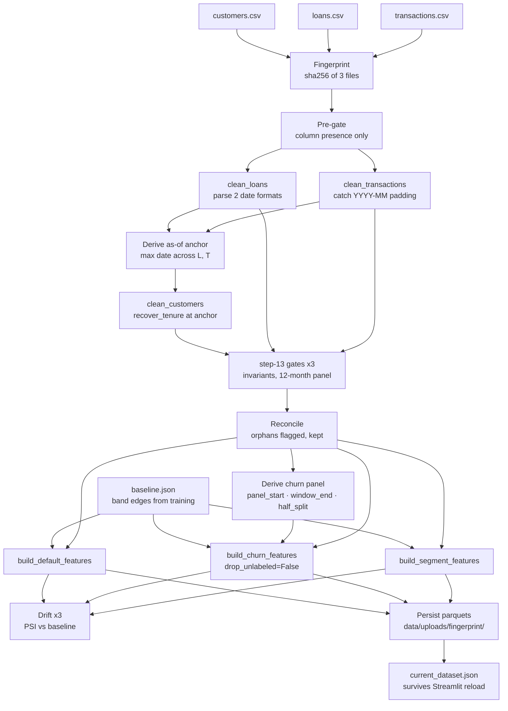

**Why this order:** `recover_tenure` needs an as-of anchor; the anchor is the max of `disbursed_date` and `month`, both parsed dates. So loans and transactions clean first, the anchor comes out of them, customers cleans against it. Customers can't go first — raw date strings sort alphabetically and `max()` returns nonsense.

**Handling new inputs** — a new region → cleaning flags it, analytics works, scoring refuses that one row until a config edit accepts it. A missing required column → the pre-gate rejects the file naming what's missing, never a stack trace twelve steps deep. Extra columns → reported, not silently dropped. Same file twice → recognised by fingerprint, pointer updated, no rebuild.

## The graph — ten nodes per question

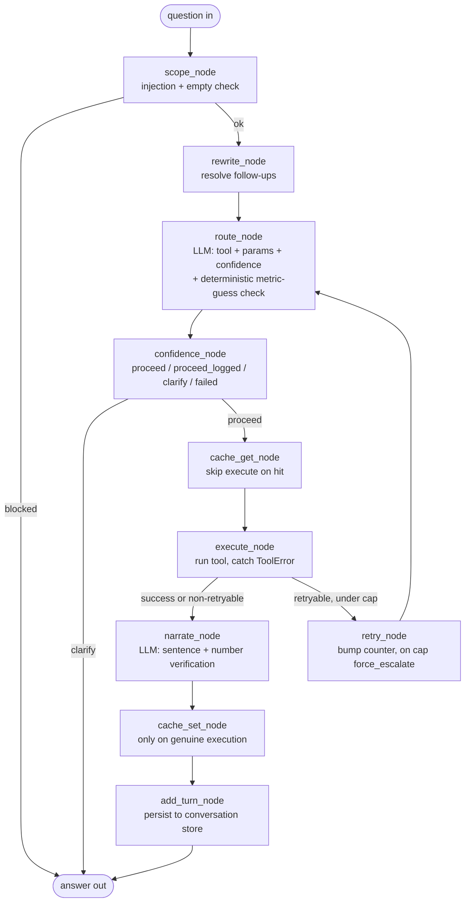

**Choices worth naming:** the **rewriter runs before the router**, so follow-ups like *and by region?* become standalone questions the router can read — and it under-resolves rather than over-resolves, because a spurious carried-over filter is worse than one clarifying turn. **Retry is a visible edge**, not a hidden loop inside execute, so a trace shows exactly one router pass or two. **Cache sits after the router, before execute**, keyed on `(fingerprint, tier, tool, sorted-params)` — hits still narrate, because the cache saves the expensive part (Tier 3 generation, ~10–15s), not the sentence. The **checkpointer is SQLite**, which made two bugs findable: leaked per-turn state from a prior conversation, and follow-ups short-circuiting on a restored `answer` field.

## The guardrail stack — six control points


Each is a pure function with a counter in SQLite, visible on the **Control room** page — a count stuck at zero is how you find a guardrail that never actually worked.

1. **Scope** — injection (*ignore previous instructions…*), empty messages, off-domain questions. Blocked in ~0.15s; a real answered turn takes 6–47s. The gap is itself a diagnostic.
2. **Validate** — a `metric` or `group_by` the data doesn't have → a factual error naming the closest valid options, caught by the graph, which reroutes.
3. **Confidence** — router self-reports 0–1; ≥ 0.90 proceeds, 0.70–0.89 proceeds and logs, < 0.70 clarifies. Plus a **deterministic override**: `aggregate_metric` with a group-by and a metric the user didn't name is *forced* to clarify — closing the *rate by region?* → silently-picks-a-default bug that no prompt tuning could fix.
4. **Sandbox** — the whitelisted Tier 3 namespace. (`len` was omitted at first and every count-above-threshold question died; added back, with the reasoning documented so it's not removed again.)
5. **Iteration cap** — two Tier 3 attempts, then an honest failure. Also what triggers force-escalate.
6. **Number verification** — every number (two digits or more) in the narrated answer must appear in the result dict, after normalisation (percent ↔ decimal, commas stripped, 1% tolerance). Failures flag the answer with a banner rather than blocking it. It walks dict keys as well as values (pandas Series serialise their index as keys) and skips prose scaffolding like *top 10* to avoid false alarms.

**Why six and not one:** each has a distinct failure mode, a distinct counter, and answers a different *is the system working* question. Merging them would hide the diagnostic.

## Memory, cache & serving

**Conversation memory** — a SQLite table of `(thread_id, question, answer, tool, params, timestamp)` powering the recent-chats sidebar and giving the rewriter context; older turns summarise into a running text field. **Cache** — keyed on `(fingerprint, tier, tool, sorted-params)`, in WAL mode so concurrent Streamlit reruns don't see stale reads. **Dataset pointer** — `data/current_dataset.json` names the parquets the tools currently read, auto-hydrated on import, so the loaded dataset survives Streamlit's occasional module reset (a file on disk does what module globals can't).

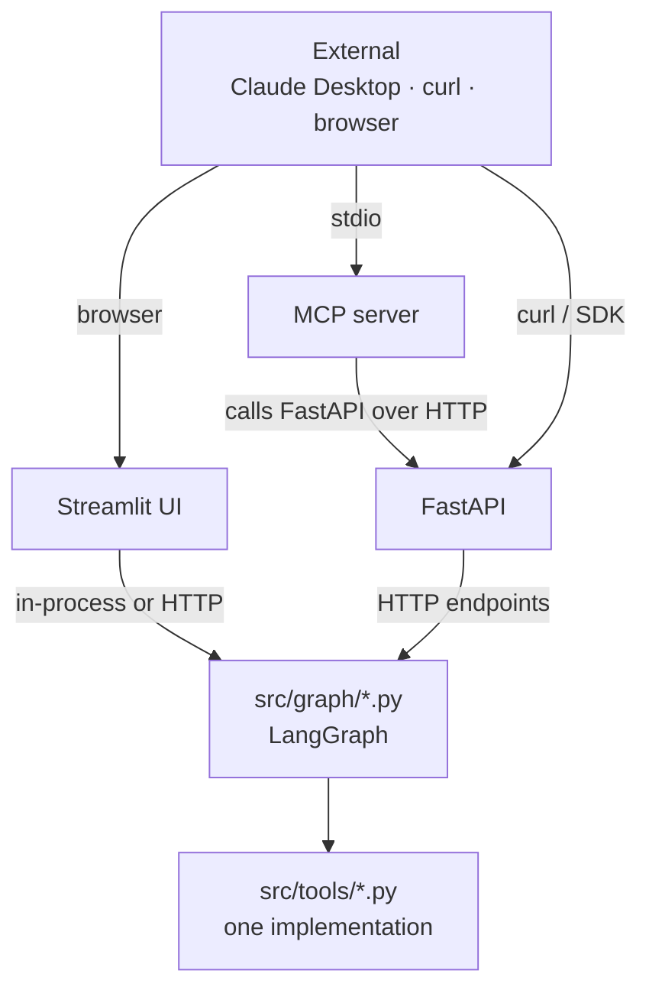

**Three doors, one implementation.** Streamlit is the primary UI (graph in-process, with a toggle to hit FastAPI over HTTP). FastAPI exposes one endpoint per tool plus `/ask`, `/health`, `/dataset`, `/counters`. The **MCP server** wraps the FastAPI layer so **Claude Desktop can query the loan book directly** — proving the tools are a reusable interface, not notebook code. Personal-data tools stay unexposed over MCP by design.

## The eval set

30 questions, each with an expected tool, including the hard cases on purpose: *how did churn change over the year* → **must refuse** (churn is one yearly verdict, no timing); *score a hypothetical applicant* → **must refuse** (no such row); *why do savers default less* → `compare_groups`, narration must frame it as association not cause; *what does the high band mean* → policy from `schema.md`, no tool call. **30/30 on the current build**, and it doubles as a coverage test — anything mapping to no tool is a missing operation shape.

---

## Decisions log — what was rejected and why

Portfolios that only list what was built read like brochures. What was *considered and rejected*, with the reasoning, is what makes a design legible.

- **RAG** — no corpus to retrieve from; the tools *are* the retrieval. (In [v2](#where-this-goes-next--v2), RAG comes back — over policy documents, not data.)
- **A pure agent loop** — the analytical surface is enumerable; eleven tools cover what a PM asks. An agent picking tools at runtime adds non-determinism to routing that regulators will want to audit. Kept an agent-shaped *surface* over a workflow-shaped *implementation*.
- **Multi-agent** — no agent-shaped decomposition; a "validator agent" and "narrator agent" would each be one function of the current graph in costume.
- **Fine-tuning** — no supervised dataset; zero-shot with strong prompts plus a validator beats fine-tuned gibberish, and Flash-Lite is cheap enough that a bigger prompt costs nothing meaningful.
- **SHAP** — for logistic regression, coefficient × scaled value is the same information with none of the dependency weight.
- **An LLM judge for number verification** — two model calls and the same failure mode (an LLM checking an LLM). Regex + normalisation catches transcription errors deterministically.
- **Auto-learning categorical values** — if `VALID_REGIONS` rebuilds from whatever arrives, the membership test can never fail and *"Punajb"* becomes a permanent seventh region. Config is a record of what's *correct*, not of what's in the file.
- **An LLM for cleaning decisions** — non-deterministic; *"the model felt it was wrong that day"* is not an answer to a regulator. An LLM may *propose* a mapping for a human to approve, never apply one.
- **Recomputing band edges per upload** — "Q1" would cover different scores each month; a user comparing months would compare two definitions.
- **Dropping rows that fail reconciliation** — orphan loans are real loans; analytics answers correctly on them. What they can't have is a trustworthy *score* — so refuse the prediction, don't delete the row.
- **Two datasets loaded at once** — pushes dataset-selection into the router (*this file or last month's?*). A real v2 feature; v1 loads one at a time.

---

## Limitations — named, not hidden

- **Model provenance.** v1 scores today's loans with a model fitted on year-old loans — normal for credit models, and precisely why drift monitoring exists. Input drift (PSI on today's inputs vs training inputs) is detectable the day the file lands; performance decay needs labels and waits out the outcome horizon.
- **Tenure floor.** The reference extract has no customer under ~9 months tenure, so both models extrapolate for genuinely new customers — a number still comes back and its direction is right, but the magnitude is unverified. Real deployment data contains new customers, so this disappears.
- **Score-then-train.** New rows have no label for months, so the system scores on arrival and trains only on matured rows — two pipelines at different speeds, by necessity.
- **No PAR, no ageing.** The outcome is a flag with no days-past-due; PAR 30/90, roll rates and provisioning aren't derivable. Refusals say what *is* available instead.
- **Cross-grain refusal.** A metric on one table grouped by a column on another is refused, not silently joined — `aggregate_metric("churned_12m", group_by="ratio_band")` would drop 5,366 non-borrowers and answer a different question.
- **One dataset, one tenant.** Loading a new dataset replaces the old, shared across all users. Fine for a demo; production needs per-user scoping, which needs auth. On the v2 list.

---

## Where this goes next — v2

Here's the part the whole design was quietly building toward.

**The realisation.** Because v1 obeys one rule — every answer is a tool call with numbers behind it — it doesn't just *answer* questions, it *accumulates* something: a growing, structured, timestamped **record of every decision the business asked about and the exact evidence behind each**. The A/B verdict on the 1.2× cap, the region-by-region default rates, the risk-based-pricing recommendation — each is stored as a reproducible trail, not a slide someone made once. In v1 that trail is a by-product. In v2 it becomes the product.

**The v2 layer — a policy-aware decision reviewer.** This is where RAG returns, and where the sister project [LegalSpy](https://github.com/ahmedsaeed56/LegalSpy) comes full circle: the same retrieval engineering, pointed at a different corpus.

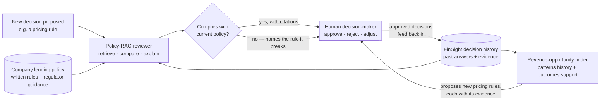

Three moves, each keeping the human in charge:

1. **Policy compliance, checked before a decision ships.** A RAG layer reads the company's written lending policy and regulator guidance. When a new rule is proposed — *"price loans above 3.5× ratio at +6% APR"* — it retrieves the relevant policy clauses and answers whether the rule complies, *citing the exact passages*, the same verbatim-source discipline LegalSpy uses for judgments. If it breaks a rule, it names the rule.

2. **New decisions the history says would pay.** The decision record, cross-referenced with realised outcomes, is a map of what's worked. The opportunity finder surfaces candidate pricing rules the data supports but nobody has tried — *"loans in the 1.2–3.5× band with tenure over 24 months defaulted at 9%, not 13% — a lighter surcharge here likely lifts approved volume without raising loss."* It never enacts anything; it hands a ranked, evidenced shortlist to a human.

3. **A human decides — and the loop closes.** Every proposal, compliant or not, goes to a person to approve, reject, or adjust. Approved decisions feed back into the history, so the reviewer gets sharper about *this* lender's real risk appetite over time.

**Why it fits this system and not a bolted-on afterthought.** The hard part of a policy reviewer is trustworthy retrieval with cited sources and a human gate — which is LegalSpy's entire architecture — sitting on top of an auditable decision trail, which is FinSight v1's entire point. v2 is the two projects meeting: **governed analytics that produces the record, and cited RAG that reasons over it, with a person holding the pen.** The governing rule never changes — the LLM retrieves, compares, and explains; it never decides. A human does, better and faster, with the policy and the evidence already on the table.

*The rest of the v2 backlog — per-user scoping and auth, PAR/ageing outcomes, arbitrary upload windows with a K-Means retrain, and automatic drift-triggered retraining — is real engineering, but the policy-RAG reviewer is the piece that turns FinSight from a question-answerer into a decision partner.*

---

## Tech stack

**Data & modelling** — Python, pandas, numpy, pyarrow, scikit-learn (logistic regression, K-Means, ColumnTransformer pipelines), XGBoost (depth-1 trees for the near-linear default signal), scipy & statsmodels for hypothesis tests and power analysis.

**LLM & orchestration** — Google Gemini Flash-Lite (routing, expression generation) and Flash (narration), LangGraph for the per-question state machine with SqliteSaver checkpointing, LangChain for the structured-output adapter, LangSmith for traces and per-turn cost (a callback, so the app runs without it).

**Serving** — Streamlit (four workspaces), FastAPI + Uvicorn (one endpoint per tool plus `/ask`), MCP Python SDK for the Claude Desktop integration.

**Persistence** — SQLite in WAL mode (cache, counters, conversation store, graph checkpoints). Parquet for feature/clean tables and upload snapshots. JSON for the dataset pointer, the band-edge baseline, and eval results.

**Dev** — Jupyter for EDA, hypothesis testing, model training; a 30-question eval set in `src/eval/` as the routing test; Docker for packaging.

---

## Repository layout

```
finsight-analytics/
├── streamlit_app.py                Primary UI
├── requirements.txt
├── Dockerfile · .dockerignore
├── PROJECT_BRIEF.md                Data dictionary + business framing
│
├── src/
│   ├── api/                        FastAPI: client, main, models
│   ├── cleaning/                   customers.py, loans.py, transactions.py
│   ├── eval/                       30-question routing eval set + runner
│   ├── features/                   default.py, churn.py, segments.py, bands.py
│   ├── graph/                      LangGraph: build, router, execute, narrate
│   ├── guardrails/                 scope, confidence, numbers, counters
│   ├── mcp_server/                 MCP server (Claude Desktop)
│   ├── memory/                     cache, conversation, rewrite, summarise
│   ├── models/                     train_*, scoring, importance, baseline
│   ├── pipeline/                   orchestrator, gate, reconcile, drift
│   ├── tools/                      analytics, inference, freeform, dataset, errors
│   ├── config.py                   paths and constants
│   ├── llm.py                      Gemini configuration
│   └── store.py                    SQLite connection (WAL)
│
├── prompts/                        router · tools · narrate · rewrite
│                                   freeform · schema · summarise
├── notebooks/                      EDA, A/B, features, models, cleaning
├── docs/                           Per-table cleaning case studies
├── models/                         Trained pickles + band-edge baseline
├── data/
│   ├── raw/                        Reference CSVs
│   ├── clean/                      Cleaned parquets
│   ├── features/                   Feature tables (train + test)
│   └── splits/                     Train/test id splits
└── assets/                         Screenshots + charts
```

---

## About the author

Built by [Ahmed Saeed](https://github.com/ahmedsaeed56) — AI/ML engineer focused on production RAG, LangGraph orchestration, and applied ML. This is one of two portfolio pillars; the other is [LegalSpy](https://github.com/ahmedsaeed56/LegalSpy), a privacy-first Pakistani legal-research RAG system where the retrieval-vs-tools decision went the *opposite* way — and where v2 of this project points back to.

**Datasets:** synthetic, generated for portfolio purposes — structured to plausibly resemble a Pakistani mobile-wallet lending book, containing no real customer data. Generation scripts in `scripts/`.

**Reading the code from the top:** `streamlit_app.py` → `src/api/client.py` → `src/graph/build.py` → then the node files and tool implementations. Read `prompts/` alongside the router and narrator — that's where most of the routing behaviour actually lives.

---

## License

MIT — see [LICENSE](LICENSE).
